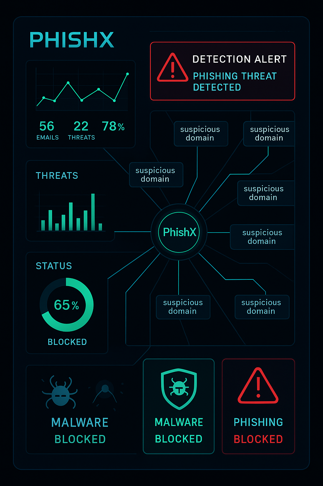

# PhishX: Advanced Phishing Detection and Threat Intelligence System



---

## **Introduction**

**PhishX** is a **cutting-edge phishing detection** and **threat intelligence** system designed to **analyze, dissect, and expose malicious websites** with surgical precision. Built for **cybersecurity analysts**, **ethical hackers**, and **digital forensics teams**, PhishX combines traditional heuristics with modern analysis techniques to **uncover phishing pages** - even those hidden behind **short URLs**, **obfuscated scripts**, or **deceptive branding**.

PhishX aims to reduce the impact of **phishing attacks** by offering **real-time detection**, **analysis**, and **alerts**.

---

## **Key Features**

- **Comprehensive URL Analysis**: PhishX thoroughly analyzes both expanded and shortened URLs to detect hidden phishing attempts.
- **SSL Certificate Validation**: Verifies whether a website’s SSL certificate is valid, helping identify suspicious or untrusted sites.
- **Domain Info Check**: Retrieves detailed domain information to check the legitimacy of the website.
- **VirusTotal Integration**: Leverages VirusTotal's extensive database to determine if a website has been flagged as malicious.
- **Heuristic Scoring**: Provides a phishing score based on various indicators, such as URL length, suspicious TLD, and more.
- **Similarity Check**: Detects visually similar domains (typosquatting) or homograph attacks.
- **Content Analysis**: Analyzes page content, including meta tags, JavaScript behavior, and forms, to uncover potential phishing tactics.

---

## **Installation**

Follow the instructions below to set up PhishX on your local machine.

### **Prerequisites**

- Python 3.10 (recommended)
- pip (Python package installer)
- Virtual environment (optional but recommended)

### **Steps to Install**

1. Clone the repository:
   ```bash
   git clone https://github.com/robertmclark298/phishx.git
   cd phishx
   pip install -r requirements.txt

